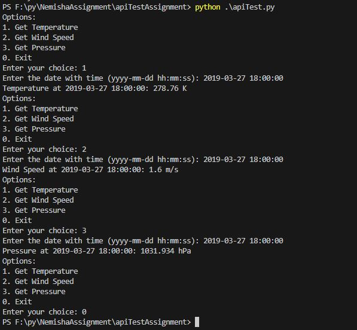

# apiTestAssignment
## Assignment 2
```
The assignment is based on an API, wherein you will have to use the data provided in the API and write a program to get the Weather report, wind speed and pressure from the user and get the result based on the API.

https://samples.openweathermap.org/data/2.5/forecast/hourly?q=London,us&appid=b6907d289e10d714a6e88b30761fae22

The above API is the REST GET API

Which gives you the response in JSON format and hourly weather forecast of London Location

I want you to write a program to get the option from the user and print the result based on the above API.


1. Get Temperature

2. Get Wind Speed

3. Get Pressure

0. Exit


If the user press 1, Prompt the user for the date with time then print the temp of the input date.

If the user press 2, Prompt the user for the date with time then print the wind.speed of the input date.

If the user press 3, Prompt the user for the date with time then print the pressure of the input date.

If the user press 0, Terminate the program.


The program should not terminate until the user press 0.

The program should be modular.

You should use Java or Python Programming language and any framework.
```

### Output:
